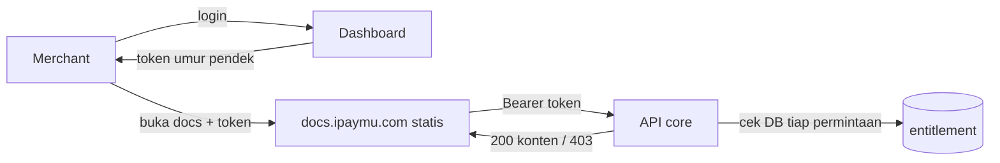

# Rencana Close API — Sisi ipaymu-core (dashboard)

Pasangan dokumen: [`PLAN-close-api-docs.md`](./PLAN-close-api-docs.md) (sisi dokumentasi).
Kontrak API di §4 **harus identik** di kedua dokumen.

Dokumen ini ditulis untuk tim ipaymu-core. Isinya apa yang harus dibangun di sisi
dashboard agar dokumentasi Close API hanya bisa dibaca merchant yang berhak.

---

## 1. Keputusan yang Sudah Dikunci

| Hal | Keputusan |
| :-- | :-- |
| Bentuk | **Opsi C** — docs tetap statis, core melayani konten + otorisasi |
| Domain docs | `https://docs.ipaymu.com` |
| Granularitas | **Per produk**, sesuai tabel §3 |
| Audit trail | Tidak perlu |
| Sandbox | Sama dengan produksi, tidak dipisah |

---

## 2. Peran Core

Situs dokumentasi adalah berkas statis di hosting biasa. Ia **tidak bisa** memeriksa
siapa pengunjungnya. Karena itu core memegang seluruh keamanan:

1. **Menerbitkan token** setelah merchant login di dashboard.
2. **Menyimpan entitlement** siapa boleh produk apa.
3. **Melayani konten** Close API, dan menolak yang tidak berhak.

Docs hanya cangkang penampil. Kalau core menolak, tidak ada yang bisa ditampilkan —
karena dokumennya memang tidak pernah ada di bundel statis.



---

## 3. Model Data

```sql
CREATE TABLE account_close_api_access (
  account_id   BIGINT      NOT NULL,   -- FK ke account (VA), mis. 1179000899
  product_slug VARCHAR(64) NOT NULL,   -- mis. 'transfer-va'
  granted_at   TIMESTAMP   NOT NULL DEFAULT CURRENT_TIMESTAMP,
  PRIMARY KEY (account_id, product_slug)
);
```

Pencabutan akses = hapus baris. Tidak perlu kolom status, dan tidak perlu tabel
audit (sesuai keputusan).

### Peta produk → halaman

| `product_slug` | Halaman yang boleh dibuka |
| :-- | :-- |
| `register` | `register` |
| `transfer-va` | `transfer-va` |
| `profile` | `profile` |
| `verification` | `member-verification`, `merchant-verification`, `bank-list`, `business-category` |

Aturan tambahan: halaman ikhtisar (slug kosong) boleh dibuka **semua akun yang
punya minimal satu baris** di tabel di atas. Isinya mekanisme signature bersama.

Petakan di satu tempat saja (konstanta di core), jangan disebar di banyak handler.

---

## 4. Kontrak API

Semua endpoint di bawah `/api/v2/close-api-docs/`. Berlaku di kedua lingkungan:
`https://my.ipaymu.com` dan `https://sandbox.ipaymu.com`.

### 4.1 Terbitkan token

```http
POST /api/v2/close-api-docs/token
Cookie: <sesi dashboard aktif>
```

```json
{ "token": "<jwt>", "expiresIn": 900 }
```

- Menolak kalau tidak ada sesi dashboard.
- Menolak (`403`) kalau akun tidak punya satu pun produk Close API.

### 4.2 Manifest — penggerak menu

```http
GET /api/v2/close-api-docs/manifest?lang=id
Authorization: Bearer <jwt>
```

```json
{
  "products": [
    {
      "slug": "verification",
      "pages": [
        { "slug": "member-verification",   "title": "Member Verification" },
        { "slug": "merchant-verification", "title": "Merchant Verification" }
      ]
    }
  ]
}
```

**Hanya kembalikan yang boleh dilihat.** Produk yang tidak dimiliki tidak boleh
muncul sama sekali — jangan dikirim lalu ditandai terkunci, karena itu membocorkan
daftar produk yang ada.

### 4.3 Konten satu halaman

```http
GET /api/v2/close-api-docs/page?lang=id&slug=transfer-va
Authorization: Bearer <jwt>
```

```json
{
  "slug": "transfer-va",
  "title": "Split Payment (Transfer VA)",
  "html": "<h2>Endpoint</h2>...",
  "toc": [{ "depth": 2, "title": "Endpoint", "url": "#endpoint" }]
}
```

### 4.4 Kode status

| Kode | Kapan |
| :-- | :-- |
| `200` | Berhak |
| `401` | Token tidak ada, rusak, kedaluwarsa, atau `aud` tidak cocok |
| `403` | Token sah tapi akun tidak berhak atas slug ini |
| `404` | Slug tidak dikenal |

Pesan `403` **tidak boleh** membocorkan apakah slug itu ada dan berbayar, atau
tidak ada sama sekali. Gunakan kalimat netral.

---

## 5. Spesifikasi Token

```json
{
  "iss": "https://my.ipaymu.com",
  "aud": "https://docs.ipaymu.com",
  "sub": "1179000899",
  "env": "production",
  "iat": 1750000000,
  "exp": 1750000900,
  "jti": "..."
}
```

### Aturan

- **TTL 5–15 menit.** Ini tiket masuk, bukan sesi.
- `aud` wajib `https://docs.ipaymu.com`; tolak kalau tidak cocok.
- `iss` menyatakan lingkungan. Docs memakainya untuk menentukan base URL
  permintaan berikutnya, sehingga satu bundel statis melayani sandbox dan produksi.
- Tanda tangan: HS256 dengan secret yang hanya ada di core sudah cukup, karena
  hanya core yang memverifikasi. Tidak perlu RS256.

### Yang sengaja TIDAK dimasukkan ke token

**Jangan menaruh daftar produk di dalam token.**

Alasannya: token berumur 15 menit, sedangkan akses bisa dicabut kapan saja. Kalau
daftar produk ikut ditandatangani di token, ada jendela sampai 15 menit di mana
akses yang sudah dicabut masih diterima.

Token cukup menyatakan **siapa** (`sub`) dan **di lingkungan mana** (`env`).
Entitlement selalu dibaca dari DB pada setiap permintaan. Dengan begitu pencabutan
berlaku seketika, dan tidak perlu mekanisme daftar-hitam `jti`.

---

## 6. Otorisasi

Pseudocode yang berlaku untuk `manifest` maupun `page`:

```
token = verifikasiJWT(header Authorization)      # gagal -> 401
if token.aud != "https://docs.ipaymu.com":       return 401
if token.exp lewat:                              return 401

produk = DB.produkAktif(token.sub)               # SELALU dari DB, bukan token
if produk kosong:                                return 403

# manifest
return halamanUntuk(produk)                      # hanya yang boleh

# page
if slug kosong:                                  return ikhtisar   # semua yg punya produk
if slug tidak dikenal:                           return 404
if produkPemilik(slug) not in produk:            return 403
return konten(lang, slug)
```

Titik terpenting: baris `DB.produkAktif(...)` dijalankan **setiap permintaan**.
Jangan di-cache lebih dari beberapa detik.

---

## 7. Header Respons

| Header | Nilai | Alasan |
| :-- | :-- | :-- |
| `Cache-Control` | `no-store` | Konten privat tidak boleh mengendap di cache/CDN |
| `Access-Control-Allow-Origin` | `https://docs.ipaymu.com` | Origin tunggal, **bukan** `*` |
| `Access-Control-Allow-Headers` | `Authorization` | Docs mengirim Bearer |
| `Vary` | `Origin` | Cegah tercampurnya respons antar origin |
| `X-Content-Type-Options` | `nosniff` | |

`Access-Control-Allow-Origin: *` tidak boleh dipakai bersama endpoint yang
memeriksa `Authorization`.

---

## 8. Sumber Konten

Core **tidak menulis** dokumentasi. Konten tetap ditulis sebagai MDX di repo docs.
Repo tersebut menghasilkan artefak siap saji:

```
close-api-content/
├── manifest.json          # slug + judul per bahasa
├── id/<slug>.html
└── en/<slug>.html
```

Core menyimpan artefak ini (filesystem privat, object storage, atau tabel) dan
melayaninya lewat endpoint §4. Pembaruan dokumen = ambil artefak versi baru.

Konsekuensi: core tidak perlu tahu apa-apa soal MDX, Next.js, atau proses build docs.
Ia hanya menyimpan HTML dan memutuskan siapa boleh membacanya.

---

## 9. Tautan dari Dashboard

Tombol **"Dokumentasi Close API"** hanya dirender kalau akun punya minimal satu
produk. Saat diklik:

1. Panggil `POST /api/v2/close-api-docs/token`.
2. Arahkan ke:

```
https://docs.ipaymu.com/id/close-api#token=<jwt>
```

Gunakan **fragment** (`#`), bukan query string (`?`). Fragment tidak pernah dikirim
ke server: tidak masuk access log, tidak bocor lewat header `Referer`, tidak
tersimpan di log proxy perantara. Query string bocor di ketiganya.

Untuk akun sandbox, tautannya sama; yang berbeda hanya `iss` di dalam token, dan
docs akan otomatis mengarahkan permintaan berikutnya ke `sandbox.ipaymu.com`.

---

## 10. Daftar Periksa Keamanan

- [ ] Entitlement dibaca dari DB pada **setiap** permintaan, bukan dari klaim token.
- [ ] Token TTL ≤ 15 menit.
- [ ] `aud` diverifikasi ketat.
- [ ] CORS dibatasi `https://docs.ipaymu.com`, bukan wildcard.
- [ ] `Cache-Control: no-store` pada semua respons konten.
- [ ] Manifest tidak membocorkan produk yang tidak dimiliki.
- [ ] Pesan `403` netral, tidak membedakan "tidak berhak" dan "tidak ada".
- [ ] Endpoint token menolak permintaan tanpa sesi dashboard.
- [ ] Rate limit pada endpoint token dan page.
- [ ] Artefak konten disimpan di lokasi yang tidak bisa diakses publik langsung.

Butir terakhir mudah terlewat: kalau `close-api-content/` diletakkan di dalam
document root yang dilayani web server, seluruh gerbang ini jadi percuma.

---

## 11. Uji yang Wajib Lulus

| Skenario | Harapan |
| :-- | :-- |
| Permintaan tanpa `Authorization` | `401` |
| Token kedaluwarsa | `401` |
| Token dengan `aud` lain | `401` |
| Akun tanpa produk apa pun | `403` |
| Punya `register`, minta `transfer-va` | `403` |
| Punya `verification`, minta `bank-list` | `200` |
| Punya `register`, minta ikhtisar (slug kosong) | `200` |
| Akses dicabut, token lama masih berlaku | `403` **seketika** |
| Slug karangan | `404` |
| Akses langsung ke berkas artefak konten | tidak bisa dijangkau |

Baris "akses dicabut, token lama masih berlaku" adalah pembeda utama desain ini.
Kalau baris itu lulus, berarti entitlement memang dibaca dari DB dan bukan dari token.

---

## 12. Urutan Kerja

| Tahap | Isi |
| :-- | :-- |
| 1 | Tabel `account_close_api_access` + UI admin pemberian/pencabutan akses |
| 2 | Endpoint token + verifikasi JWT |
| 3 | Penyimpanan artefak konten dari repo docs |
| 4 | Endpoint `manifest` dan `page` + otorisasi |
| 5 | CORS, header, rate limit |
| 6 | Uji §11 |
| 7 | Tombol di dashboard |

Tahap 1–2 sudah cukup bagi tim docs untuk mulai mengintegrasikan; tahap 3–4 bisa
menyusul karena docs bisa memakai API tiruan lebih dulu.

---

## 13. Yang Perlu Disepakati Bersama

1. Nama persis endpoint (dokumen ini memakai `/api/v2/close-api-docs/*`).
2. Cara artefak konten dikirim dari repo docs ke core: unduhan artifact CI,
   rilis bertag, atau unggah manual.
3. Siapa memegang secret penandatangan JWT dan bagaimana dirotasi.
4. Perilaku saat merchant membuka docs langsung tanpa lewat dashboard — apakah
   diarahkan ke halaman login dashboard, atau cukup ditampilkan pesan.
