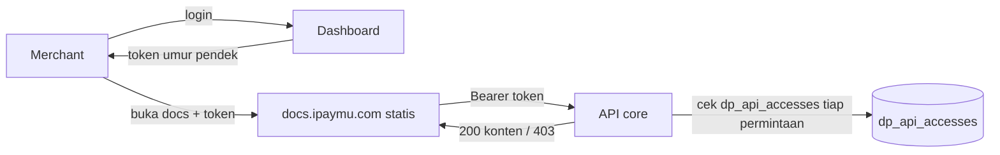

# Rencana Close API — Sisi ipaymu-core (dashboard)

Pasangan dokumen: [`PLAN-close-api-docs.md`](./PLAN-close-api-docs.md) (sisi dokumentasi).
Kontrak API di §4 **harus identik** di kedua dokumen.

Dokumen ini ditulis untuk tim ipaymu-core. Isinya apa yang harus dibangun di sisi
dashboard agar dokumentasi Close API hanya bisa dibaca merchant yang berhak.

---

## 1. Keputusan yang Sudah Dikunci

| Hal | Keputusan |
| :-- | :-- |
| Bentuk | **Opsi C** — docs tetap statis, core melayani konten + otorisasi |
| Domain docs | `https://docs.ipaymu.com` |
| Granularitas | **Per produk (api_code)**, sesuai `config/closeapi.php` |
| Sumber entitlement | Tabel **`dp_api_accesses`** (yang sudah dipakai untuk gerbang API) |
| Audit trail | Tidak perlu |
| Sandbox | Sama dengan produksi, tidak dipisah |

---

## 1a. Kondisi Saat Ini (yang sudah ada)

Sebagian pondasi **sudah terpasang** di core, plan ini menyesuaikan ke sana:

| Komponen | Status | Lokasi |
| :-- | :-- | :-- |
| Tabel entitlement `dp_api_accesses` | **Ada** (dipakai `ApiAccessCheck` untuk gerbang API `apicheck:<code>`) | `App\ApiAccess` |
| Peta `api_code → {name, slug}` + `docs_base_url` | **Ada** | `config/closeapi.php` |
| Dashboard menampilkan Close API milik merchant | **Ada** | `IntegrationController@index` → view `user.integration.index` |
| Link "buka docs" | **Ada, tapi belum aman** — memakai `?access=slug1,slug2` (query string, bisa dipalsukan) | `IntegrationController@index` (`$closeApiDocsUrl`) |
| Endpoint token + verifikasi per-permintaan di docs | **Belum** | — |

**Fokus plan ini:** mengganti link `?access=…` yang bisa dipalsukan dengan
**token pendek + verifikasi entitlement per permintaan** (bagian §4–§6), supaya
docs Close API **hanya** bisa dibuka merchant yang login di dashboard — bukan
siapa pun yang menebak URL.

---

## 2. Peran Core

Situs dokumentasi adalah berkas statis di hosting biasa. Ia **tidak bisa** memeriksa
siapa pengunjungnya. Karena itu core memegang seluruh keamanan:

1. **Menerbitkan token** setelah merchant login di dashboard.
2. **Menyimpan entitlement** siapa boleh produk apa.
3. **Melayani konten** Close API, dan menolak yang tidak berhak.

Docs hanya cangkang penampil. Kalau core menolak, tidak ada yang bisa ditampilkan —
karena dokumennya memang tidak pernah ada di bundel statis.



---

## 3. Model Data

**Tidak membuat tabel baru.** Entitlement Close API = akses API yang sudah
dimiliki merchant, yaitu tabel yang sudah ada **`dp_api_accesses`**:

```sql
-- dp_api_accesses (ringkas, kolom yang relevan)
--   member_id   BIGINT   -- FK ke dp_members.id (pemilik akses)
--   api_code    SMALLINT -- kode produk API, mis. 506 = Split Payment
--   status      SMALLINT -- 1 = aktif; selain itu = tidak aktif
--   version     SMALLINT
--   ...
-- Satu baris = satu produk API yang di-grant ke satu merchant.
```

- **Pemberian/pencabutan akses tidak dibangun ulang.** Sudah ada alurnya (admin
  grant `dp_api_accesses`, mis. lewat settlement-dashboard `members/{id}/list-api`).
- Entitlement dibaca `WHERE member_id = ? AND status = 1`.
- Model: `App\ApiAccess`. Helper: `ApiAccess::grantAccessByUserId($memberId, $code)`.

### Peta `api_code` → produk/slug (sumber: `config/closeapi.php`)

Pemetaan **sudah ada** dan menjadi satu-satunya sumber. Jangan disebar ke banyak
handler — baca dari config ini.

```php
// config/closeapi.php  (nilai saat ini)
'docs_base_url' => env('IPAYMU_DOCS_BASE_URL', 'https://docs.ipaymu.com'),
'products' => [
    '100' => ['name' => 'Register SSO',       'slug' => 'register'],
    '506' => ['name' => 'Split Payment',      'slug' => 'transfer-va'],
    '507' => ['name' => 'Transfer Member',    'slug' => 'transfer-va'],
    '405' => ['name' => 'List Balance by VA', 'slug' => null],
    '500' => ['name' => 'History Transaksi',  'slug' => null],
    '504' => ['name' => 'Withdraw Custom',    'slug' => null],
    '505' => ['name' => 'Transaksi Reversal', 'slug' => null],
    '501' => ['name' => 'Withdraw',           'slug' => null],
    '513' => ['name' => 'Qris Issuer',        'slug' => null],
],
```

Aturan:
- `slug = null` → produk dimiliki tapi **halaman docs belum terbit**; tampilkan
  di daftar tanpa link. Isi slug begitu halamannya ada di `docs-ipaymu-api-v2`.
- Beberapa `api_code` boleh menunjuk **slug yang sama** (mis. 506 & 507 →
  `transfer-va`). Entitlement per-slug = "punya minimal satu `api_code` yang
  memetakan ke slug itu".
- Halaman **ikhtisar** (slug kosong) boleh dibuka semua akun yang punya
  **minimal satu** baris `dp_api_accesses` aktif yang slug-nya tidak null.

> Catatan: `dp_api_accesses.api_code` bertipe SMALLINT, key di config bertipe
> string. Samakan tipe saat mencocokkan (cast ke string), seperti yang sudah
> dilakukan `IntegrationController` (`->map(fn($c) => (string) $c)`).

---

## 4. Kontrak API

Semua endpoint di bawah `/api/v2/close-api-docs/`. Berlaku di kedua lingkungan:
`https://my.ipaymu.com` dan `https://sandbox.ipaymu.com`.

### 4.1 Terbitkan token

```http
POST /api/v2/close-api-docs/token
Cookie: <sesi dashboard aktif>
```

```json
{ "token": "<jwt>", "expiresIn": 21600 }
```

- Menolak kalau tidak ada sesi dashboard (`401`).
- Menolak (`403`) kalau akun tidak punya satu pun baris `dp_api_accesses` aktif
  (`status = 1`) yang slug-nya sudah terbit di `config/closeapi.php`.

### 4.2 Manifest — penggerak menu

```http
GET /api/v2/close-api-docs/manifest?lang=id
Authorization: Bearer <jwt>
```

```json
{
  "products": [
    { "slug": "register",    "name": "Register SSO" },
    { "slug": "transfer-va", "name": "Split Payment" }
  ]
}
```

Isi diambil dari `config('closeapi.products')`: untuk tiap `api_code` aktif milik
merchant yang `slug`-nya tidak null. Slug yang sama dari beberapa `api_code`
(506 & 507 → `transfer-va`) di-**dedupe** menjadi satu entri.

**Hanya kembalikan yang boleh dilihat.** Produk yang tidak dimiliki tidak boleh
muncul sama sekali — jangan dikirim lalu ditandai terkunci, karena itu membocorkan
daftar produk yang ada.

### 4.3 Konten satu halaman

```http
GET /api/v2/close-api-docs/page?lang=id&slug=transfer-va
Authorization: Bearer <jwt>
```

```json
{
  "slug": "transfer-va",
  "title": "Split Payment (Transfer VA)",
  "html": "<h2>Endpoint</h2>...",
  "toc": [{ "depth": 2, "title": "Endpoint", "url": "#endpoint" }]
}
```

### 4.4 Kode status

| Kode | Kapan |
| :-- | :-- |
| `200` | Berhak |
| `401` | Token tidak ada, rusak, kedaluwarsa, atau `aud` tidak cocok |
| `403` | Token sah tapi akun tidak berhak atas slug ini |
| `404` | Slug tidak dikenal |

Pesan `403` **tidak boleh** membocorkan apakah slug itu ada dan berbayar, atau
tidak ada sama sekali. Gunakan kalimat netral.

---

## 5. Spesifikasi Token

```json
{
  "iss": "https://my.ipaymu.com",
  "aud": "https://docs.ipaymu.com",
  "sub": "284915",
  "env": "production",
  "iat": 1750000000,
  "exp": 1750000900,
  "jti": "..."
}
```

### Aturan

- `sub` = **`dp_members.id`** (member_id) pemilik akses. Inilah kunci untuk
  membaca `dp_api_accesses.member_id`. (Kalau lebih nyaman memakai VA/`baccount`
  sebagai `sub`, resolusikan ke `member_id` sekali di awal — jangan mengubah
  kunci entitlement.)
- **TTL 6 jam** (`CLOSE_API_DOCS_JWT_TTL`, default 21600 detik). Cukup untuk
  satu sesi baca tanpa merchant harus bolak-balik ke dashboard.
- `aud` wajib `https://docs.ipaymu.com`; tolak kalau tidak cocok.
- `iss` menyatakan lingkungan. Docs memakainya untuk menentukan base URL
  permintaan berikutnya, sehingga satu bundel statis melayani sandbox dan produksi.
- Tanda tangan: HS256 dengan secret yang hanya ada di core sudah cukup, karena
  hanya core yang memverifikasi. Tidak perlu RS256.

### Yang sengaja TIDAK dimasukkan ke token

**Jangan menaruh daftar produk di dalam token.**

Alasannya: token berumur 6 jam, sedangkan akses bisa dicabut kapan saja. Kalau
daftar produk ikut ditandatangani di token, ada jendela sampai 6 jam di mana
akses yang sudah dicabut masih diterima. Justru karena TTL-nya panjang, aturan
ini makin penting.

Token cukup menyatakan **siapa** (`sub`) dan **di lingkungan mana** (`env`).
Entitlement selalu dibaca dari DB pada setiap permintaan. Dengan begitu pencabutan
berlaku seketika, dan tidak perlu mekanisme daftar-hitam `jti`.

---

## 6. Otorisasi

Pseudocode yang berlaku untuk `manifest` maupun `page`:

```
token = verifikasiJWT(header Authorization)      # gagal -> 401
if token.aud != "https://docs.ipaymu.com":       return 401
if token.exp lewat:                              return 401

# SELALU dari DB, bukan token:
codes = SELECT api_code FROM dp_api_accesses
        WHERE member_id = token.sub AND status = 1
slugs = { config('closeapi.products')[code].slug
          for code in codes if slug != null }    # cast code ke string
if slugs kosong:                                 return 403

# manifest
return halamanUntuk(slugs)                       # hanya slug yang boleh

# page
if slug kosong:                                  return ikhtisar   # semua yg punya >=1 slug
if slug tidak dikenal (bukan slug produk):       return 404
if slug not in slugs:                            return 403
return konten(lang, slug)
```

Titik terpenting: query `dp_api_accesses` dijalankan **setiap permintaan**.
Jangan di-cache lebih dari beberapa detik — supaya pencabutan akses
(`status → 0` atau hapus baris) berlaku seketika. Ini yang membuat gerbang benar
dijaga core, bukan URL yang bisa ditebak dari luar.

---

## 7. Header Respons

| Header | Nilai | Alasan |
| :-- | :-- | :-- |
| `Cache-Control` | `no-store` | Konten privat tidak boleh mengendap di cache/CDN |
| `Access-Control-Allow-Origin` | `https://docs.ipaymu.com` | Origin tunggal, **bukan** `*` |
| `Access-Control-Allow-Headers` | `Authorization` | Docs mengirim Bearer |
| `Vary` | `Origin` | Cegah tercampurnya respons antar origin |
| `X-Content-Type-Options` | `nosniff` | |

`Access-Control-Allow-Origin: *` tidak boleh dipakai bersama endpoint yang
memeriksa `Authorization`.

---

## 8. Sumber Konten

Core **tidak menulis** dokumentasi. Konten tetap ditulis sebagai MDX di repo docs.
Repo tersebut menghasilkan artefak siap saji:

```
close-api-content/
├── manifest.json          # slug + judul per bahasa
├── id/<slug>.html
└── en/<slug>.html
```

Core menyimpan artefak ini (filesystem privat, object storage, atau tabel) dan
melayaninya lewat endpoint §4. Pembaruan dokumen = ambil artefak versi baru.

Konsekuensi: core tidak perlu tahu apa-apa soal MDX, Next.js, atau proses build docs.
Ia hanya menyimpan HTML dan memutuskan siapa boleh membacanya.

---

## 9. Tautan dari Dashboard

Sudah ada di `IntegrationController@index` (halaman **Integration**): daftar
Close API milik merchant (`closeApiProducts`) dan flag `hasCloseApi`. Yang perlu
**diubah** hanya cara membuka docs.

**Alur yang diinginkan (sesuai kebutuhan):**
1. Dashboard menampilkan daftar Close API yang dimiliki merchant (sudah ada).
2. Merchant klik salah satu produk (atau tombol "Buka Dokumentasi Close API").
3. Dashboard memanggil `POST /api/v2/close-api-docs/token` (pakai sesi login).
4. Buka **tab baru** ke docs dengan token di **fragment**:

```
https://docs.ipaymu.com/id/close-api#token=<jwt>
# untuk buka langsung ke satu produk:
https://docs.ipaymu.com/id/close-api/transfer-va#token=<jwt>
```

**Ganti yang sekarang.** `IntegrationController` saat ini memakai
`…/close-api?access=slug1,slug2`. Daftar slug di query string itu **bisa
dipalsukan** siapa saja — jadi belum memenuhi syarat "hanya bisa diakses user
yang terdaftar di dashboard". Setelah endpoint token (§4.1) siap:

- Hentikan pemakaian `?access=…` sebagai penentu akses. Slug boleh tetap dikirim
  hanya untuk UX (menu awal), tetapi **konten tetap ditentukan token + cek DB**
  di §6 — bukan dari daftar slug di URL.
- Pakai **fragment** (`#`), bukan query string. Fragment tidak dikirim ke server:
  tidak masuk access log, tidak bocor lewat `Referer`, tidak tersimpan di proxy.

Kalau merchant membuka URL docs langsung tanpa token (mis. menebak/menyalin
link), docs tidak punya token valid → permintaan ke core `401` → tidak ada
konten yang tampil. Inilah yang memenuhi **"tidak bisa dilihat lewat link dari
luar"**.

Untuk akun sandbox, tautannya sama; yang berbeda hanya `iss` di dalam token, dan
docs akan otomatis mengarahkan permintaan berikutnya ke `sandbox.ipaymu.com`.

---

## 10. Daftar Periksa Keamanan

- [ ] Entitlement dibaca dari DB pada **setiap** permintaan, bukan dari klaim token.
- [ ] Token TTL sesuai kebijakan (default 6 jam) dan entitlement tetap dibaca per permintaan.
- [ ] `aud` diverifikasi ketat.
- [ ] CORS dibatasi `https://docs.ipaymu.com`, bukan wildcard.
- [ ] `Cache-Control: no-store` pada semua respons konten.
- [ ] Manifest tidak membocorkan produk yang tidak dimiliki.
- [ ] Pesan `403` netral, tidak membedakan "tidak berhak" dan "tidak ada".
- [ ] Endpoint token menolak permintaan tanpa sesi dashboard.
- [ ] Rate limit pada endpoint token dan page.
- [ ] Artefak konten disimpan di lokasi yang tidak bisa diakses publik langsung.

Butir terakhir mudah terlewat: kalau `close-api-content/` diletakkan di dalam
document root yang dilayani web server, seluruh gerbang ini jadi percuma.

---

## 11. Uji yang Wajib Lulus

| Skenario | Harapan |
| :-- | :-- |
| Permintaan tanpa `Authorization` | `401` |
| Token kedaluwarsa | `401` |
| Token dengan `aud` lain | `401` |
| Akun tanpa `dp_api_accesses` aktif (slug≠null) | `403` |
| Punya `register` (code 100), minta `transfer-va` | `403` |
| Punya Split Payment (code 506), minta `transfer-va` | `200` |
| Punya code 507 saja, minta `transfer-va` | `200` (507 & 506 → slug sama) |
| Punya `register`, minta ikhtisar (slug kosong) | `200` |
| `dp_api_accesses.status` diubah ke 0, token lama masih berlaku | `403` **seketika** |
| Slug karangan / slug yang belum terbit (`slug=null`) | `404` |
| Buka URL docs langsung tanpa token (link dari luar) | `401` — tidak ada konten |
| Akses langsung ke berkas artefak konten | tidak bisa dijangkau |

Baris "akses dicabut, token lama masih berlaku" adalah pembeda utama desain ini.
Kalau baris itu lulus, berarti entitlement memang dibaca dari DB dan bukan dari token.

---

## 12. Urutan Kerja

| Tahap | Isi | Status |
| :-- | :-- | :-- |
| 1 | Entitlement `dp_api_accesses` + peta `config/closeapi.php` + grant/revoke akses | **Sudah ada** |
| 2 | Dashboard menampilkan daftar Close API milik merchant | **Sudah ada** (`IntegrationController@index`) |
| 3 | Endpoint token (`POST /token`) + verifikasi JWT | **Selesai** |
| 4 | Penyimpanan artefak konten dari repo docs | **Wadah siap** — isi menyusul dari repo docs |
| 5 | Endpoint `manifest` dan `page` + otorisasi (baca `dp_api_accesses` per permintaan) | **Selesai** |
| 6 | CORS, header, rate limit | **Selesai** |
| 7 | Ganti link dashboard `?access=…` → token di fragment (§9) | **Selesai** |
| 8 | Uji §11 | **Lulus** (diverifikasi di lingkungan lokal) |

### Berkas hasil implementasi (core)

| Berkas | Isi |
| :-- | :-- |
| `config/closeapi.php` | Peta produk (sudah ada) + setelan token JWT + `content_path` |
| `app/Services/CloseApiDocsService.php` | Entitlement dari `dp_api_accesses`, terbit/verifikasi token, baca artefak |
| `app/Http/Middleware/CloseApiDocsAuth.php` | Gerbang Bearer token (401) |
| `app/Http/Middleware/CloseApiDocsCors.php` | CORS origin tunggal + `no-store` (global, dijaga path) |
| `app/Http/Controllers/Api/v2/CloseApiDocsController.php` | `token`, `manifest`, `page` |
| `routes/web.php` | `POST /api/v2/close-api-docs/token` (sesi dashboard, throttle 20/menit) |
| `routes/api.php` | `GET manifest`, `GET page` (throttle 60/menit) |
| `storage/app/close-api-content/` | Lokasi artefak **privat** (+ README struktur) |

> Catatan implementasi CORS: middleware global `HandleCors` memasang
> `Access-Control-Allow-Origin: *` untuk `api/*`. Karena itu `CloseApiDocsCors`
> didaftarkan sebagai middleware **global paling awal** (berjalan paling akhir
> saat respons) dan dijaga agar hanya aktif di path `api/v2/close-api-docs/*`.
> Untuk origin yang tidak dikenal, header wildcard **dibuang**, bukan ditimpa.

**Sisa pekerjaan:** mengirim artefak konten dari repo docs ke
`storage/app/close-api-content/<lang>/<slug>.html` (+ `.json` opsional untuk
`title`/`toc`), dan mengisi `slug` di `config/closeapi.php` begitu halamannya
terbit. Sebelum artefak ada, `manifest` sudah berfungsi penuh dan `page`
menjawab `404` — cukup bagi tim docs untuk mulai mengintegrasikan.

---

## 13. Yang Perlu Disepakati Bersama

1. Nama persis endpoint (dokumen ini memakai `/api/v2/close-api-docs/*`).
2. Cara artefak konten dikirim dari repo docs ke core: unduhan artifact CI,
   rilis bertag, atau unggah manual.
3. Siapa memegang secret penandatangan JWT dan bagaimana dirotasi.
4. Perilaku saat merchant membuka docs langsung tanpa lewat dashboard: token
   tidak ada → core balas `401` → docs menampilkan pesan "buka dari dashboard"
   (atau arahkan ke login dashboard). **Sudah diputuskan di §9**, tinggal
   sepakati teks/redirect-nya.
5. `sub` token: pakai `member_id` (rekomendasi plan ini) atau `baccount`/VA —
   pastikan konsisten dengan cara membaca `dp_api_accesses`.
6. Isi slug di `config/closeapi.php` menyusul saat halaman docs terbit
   (`slug: null` → isi slug). Ini murni update config, tanpa ubah logika.
