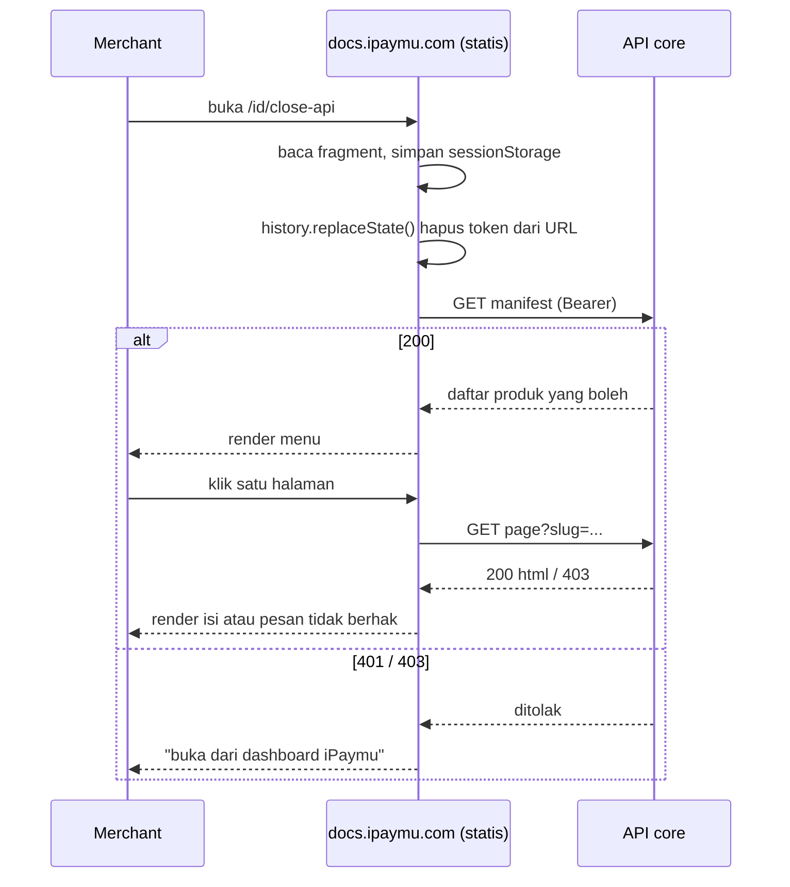

# Rencana Close API — Sisi Dokumentasi (repo ini)

Pasangan dokumen: [`PLAN-close-api-core.md`](./PLAN-close-api-core.md) (sisi ipaymu-core).
Kontrak API antar keduanya ada di §4 dan **harus identik** di kedua dokumen.

Menggantikan: `PLAN-close-api-gating.md` (draf gabungan, sudah dihapus).

---

## 1. Keputusan yang Sudah Dikunci

| Hal | Keputusan |
| :-- | :-- |
| Bentuk | **Opsi C** — situs tetap satu bundel statis, konten diambil runtime dari API core |
| Hosting | Tetap statis (Hostinger), tidak ada proses server milik docs |
| Domain final | `https://docs.ipaymu.com` |
| Granularitas akses | **Per produk**, sesuai tabel §3 |
| Audit trail | Tidak perlu |
| Sandbox | Diperlakukan sama dengan produksi, tidak dipisah |
| Kesiapan core | Siap membangun sisi server |

---

## 2. Prinsip yang Tidak Boleh Dilanggar

> **Konten Close API tidak boleh ikut ke dalam `out/`.**

Bundel statis itu publik sepenuhnya. Kalau HTML Close API ada di dalamnya, dokumen
itu sudah bocor — tidak peduli menunya disembunyikan atau route-nya "dirahasiakan".
View-source, URL langsung, dan berkas `_next/*.txt` semuanya bisa diakses siapa pun.

Yang boleh ada di bundel publik hanyalah **cangkang kosong**: kerangka halaman yang
belum berisi apa-apa sampai ia berhasil mengambil konten dari API terautentikasi.

Perkakas yang menjaga pemisahan ini:

| Berkas | Fungsi |
| :-- | :-- |
| `content/close-api/` | 16 MDX (8 halaman × id/en) — sumber tulisan |
| `content/close-api/meta.json` | **Satu sumber kebenaran** daftar slug |
| `src/lib/close-api-slugs.ts` | Turunan `meta.json`; menghasilkan rute cangkang |
| `src/app/[lang]/close-api/` | Cangkang publik permanen (tanpa isi dokumen) |
| `private/close-api/` | Perender MDX untuk artefak; bukan halaman pengunjung |
| `scripts/build-close-api-content.mjs` | Bangun artefak → `close-api-content/` |
| `scripts/clean-staged.mjs` | Bersihkan sisa rute perender |

Pengaman kebocoran ada di `.github/workflows/hostinger.yml`: build digagalkan
kalau penanda isi dokumen (`StringToSign`, `api/v2/transferva`, dll.) muncul di
`out/`. Mencari string `close-api` **tidak lagi** dipakai sebagai pengaman —
cangkang memang wajar memuatnya.

---

## 3. Peta Produk → Halaman

Pemetaan dipegang core di `config/closeapi.php` sebagai `api_code → {name, slug}`;
lihat [`PLAN-close-api-core.md`](./PLAN-close-api-core.md) §3. Sisi docs **tidak**
menyimpan tabel hak akses sendiri — kalau ada dua salinan, keduanya akan menyimpang.

Yang menjadi tanggung jawab repo ini: memberi tahu core slug apa saja yang ada.
`npm run build:close-api-content` menghasilkan `close-api-content/manifest.json`
berisi daftar slug + judul per bahasa, dan mencetak daftarnya ke terminal agar
mudah disalin ke `config/closeapi.php`.

Slug yang terbit saat ini:

```
register  transfer-va  profile  bank-list
business-category  member-verification  merchant-verification
```

Slug yang **belum** punya `api_code` di core tidak akan muncul di menu merchant
dan dijawab `403` bila dibuka langsung. Itu perilaku aman, tapi berarti halamannya
belum bisa dibaca siapa pun — jadi setiap halaman baru butuh satu baris di
`config/closeapi.php`.

Halaman ikhtisar (`/close-api` tanpa slug) diekspor sebagai `overview` dan boleh
dibuka **semua akun yang punya minimal satu produk** — isinya mekanisme signature
bersama, bukan rahasia produk.

---

## 4. Kontrak API

Sisi core adalah pemilik kontrak ini; [`PLAN-close-api-core.md`](./PLAN-close-api-core.md) §4
yang berlaku. Bagian di sini hanya menjelaskan cara cangkang mengonsumsinya.

Base URL **tidak** dikonfigurasi di build. Ia diambil dari klaim `iss` di dalam
token, lalu dicocokkan ke allowlist di `close-api-shell.tsx`
(`https://my.ipaymu.com`, `https://sandbox.ipaymu.com`). Dengan begitu satu bundel
statis melayani produksi dan sandbox, dan `iss` yang dipalsukan tidak bisa
mengarahkan permintaan ke origin lain. Lihat §6.2.

### 4.1 Manifest — penggerak menu

```http
GET /api/v2/close-api-docs/manifest?lang=id
Authorization: Bearer <jwt>
```

```json
{
  "products": [
    { "slug": "register",    "name": "Register SSO" },
    { "slug": "transfer-va", "name": "Split Payment" }
  ]
}
```

Manifest **hanya memuat yang boleh dilihat**. Produk yang tidak dimiliki tidak
boleh muncul sama sekali — bukan muncul lalu ditandai terkunci.

> **Pembungkus respons.** Cangkang menerima **dua** bentuk: dibungkus
> `{ Status, Success, Message, Data: {...} }` (konvensi rumah iPaymu) maupun objek
> polos seperti contoh di atas. Sengaja toleran supaya core tidak perlu
> menyesuaikan apa pun. Lihat `unwrap()` di `close-api-shell.tsx`.

### 4.2 Konten satu halaman

```http
GET /api/v2/close-api-docs/page?lang=id&slug=transfer-va
Authorization: Bearer <jwt>
```

```json
{
  "slug": "transfer-va",
  "title": "Split Payment (Transfer VA)",
  "html": "<h2>Endpoint</h2>...",
  "toc": [{ "depth": 2, "title": "Endpoint", "url": "#endpoint" }]
}
```

### 4.3 Kode status

| Kode | Arti | Yang dilakukan docs |
| :-- | :-- | :-- |
| `200` | Boleh | Render |
| `401` | Token hilang/kedaluwarsa | Tampilkan ajakan buka ulang dari dashboard |
| `403` | Tidak berhak atas slug ini | Tampilkan "tidak punya akses" |
| `404` | Slug tidak dikenal | Halaman tidak ditemukan |

---

## 5. Alur di Sisi Docs



### Kenapa token lewat fragment (`#`), bukan query (`?`)

Fragment **tidak pernah dikirim ke server**. Ia tidak masuk access log Hostinger,
tidak bocor lewat header `Referer` saat merchant mengklik tautan keluar, dan tidak
tersimpan di log proxy perantara. Query string bocor di ketiganya.

Setelah dibaca, token langsung dihapus dari URL dengan `history.replaceState()`
supaya tidak ikut tersalin saat merchant menyalin alamat halaman.

Simpan di `sessionStorage`, **bukan** `localStorage` — hilang begitu tab ditutup.

---

## 6. Pekerjaan di Repo Ini

### 6.1 Route cangkang

Buat `src/app/[lang]/close-api/[[...slug]]/page.tsx` sebagai **client component**
yang tidak memuat konten apa pun saat build.

`generateStaticParams()` mengembalikan daftar slug dari `content/close-api/meta.json`
— hanya untuk membuat kerangka HTML-nya, **tanpa** menyentuh isi MDX. Nama slug
sendiri bukan rahasia; yang dirahasiakan isinya.

Konsekuensi penting: setelah ini `out/` akan berisi berkas `close-api/*.html`.
Pemeriksaan "0 string close-api" tidak lagi berlaku sebagai pengaman — diganti
pemeriksaan §6.4.

### 6.2 Token dan allowlist issuer

Ditangani di `close-api-shell.tsx` (tidak jadi modul terpisah): baca `#token=`,
simpan ke `sessionStorage`, bersihkan address bar, buang saat `401`.

**Bagian yang tidak boleh dilepas — `ALLOWED_ISSUERS`.** Base URL core diambil
dari klaim `iss` di token, dan klaim itu hanya di-decode, **tidak** diverifikasi
tanda tangannya (secret-nya cuma ada di core). Tanpa allowlist, token palsu
berisi `iss: https://penyerang.example` membuat browser:

1. mengirim Bearer token ke server penyerang, dan
2. menerima HTML sembarang yang berakhir di DOM halaman ini — XSS pada origin
   docs, yang bisa membaca token di `sessionStorage`.

Karena itu `iss` diperlakukan sebagai pilihan dari daftar tertutup
(`https://my.ipaymu.com`, `https://sandbox.ipaymu.com`), bukan URL yang dipercaya.
Token dengan issuer di luar daftar langsung dibuang dan halaman menampilkan
"Sesi Kedaluwarsa".

### 6.3 Menu

`baseOptions()` di `src/lib/layout.shared.tsx` saat ini menampilkan menu Close API
berdasarkan `NEXT_PUBLIC_PRIVATE_BUILD`. Ganti: menu dirender kalau manifest
berhasil diambil. Ini murni kosmetik — keamanan tetap di API, bukan di sini.

Perhatikan menu ini masuk `NavSection` yang baru saja diperbaiki; nilai
`"close-api"` sudah tersedia.

### 6.4 Pengaman kebocoran di CI

Ada di `.github/workflows/hostinger.yml`, langkah *"Pastikan konten Close API
tidak bocor"*. Ia mencari penanda ISI dokumen (`StringToSign`,
`api/v2/transferva`, `api/v2/merchant-verification`, `api/v2/member-verification`,
`api/v2/banklist`, `api/v2/business-category`) di `out/` dan menggagalkan build
bila salah satu ditemukan.

Mencari string `close-api` **tidak lagi** dipakai: cangkang memang wajar memuatnya.

Pengaman ini bukan teoretis — ia langsung menangkap satu kebocoran nyata, lihat §6.6.

### 6.5 Rendering konten

Konten datang sebagai HTML dari core lalu disuntikkan dengan
`dangerouslySetInnerHTML`. Sebelum disuntikkan ia **wajib** lewat
`sanitizeCloseApiHtml()` di `src/lib/close-api-html.ts` — allowlist tag dan
atribut, buang `<script>`/`<iframe>`/`<form>`/`<svg>`, buang semua atribut `on*`,
tolak URL non-`https:`/`data:image`, dan paksa `rel="noopener noreferrer"` pada
`target="_blank"`.

Kenapa perlu padahal isinya artefak tim sendiri: HTML-nya datang lewat jaringan.
Kalau artefak di core tersabotase atau responsnya dibelokkan, skrip akan berjalan
di origin `docs.ipaymu.com` dan bisa membaca token. Sanitasi memutus rantai itu,
dan tetap berguna sebagai lapisan kedua di belakang allowlist issuer (§6.2).

Diverifikasi di browser sungguhan: 9 payload serangan dinetralkan, sementara
tabel, blok kode, anchor heading, dan diagram mermaid (`data:image/svg+xml`) tetap
utuh.

### 6.6 Artefak konten untuk core

Core tidak menyimpan MDX. `npm run build:close-api-content` menghasilkan:

```
close-api-content/
├── manifest.json          # daftar slug + judul per bahasa
├── id/<slug>.html         # potongan artikel
├── id/<slug>.json         # { title, toc }
├── en/<slug>.html
└── en/<slug>.json
```

Halaman ikhtisar diekspor sebagai `overview`. Folder ini ada di `.gitignore` —
jangan pernah di-commit. Salin ke core: `storage/app/close-api-content/`.

Penulisan dokumen tetap MDX di repo ini; alur kerja penulis tidak berubah.

> **Jebakan yang sudah ditutup.** Skrip ini membangun dengan `PRIVATE_BUILD=1`,
> sehingga `out/` sempat berisi **seluruh** isi Close API di
> `/<lang>/close-api-export/*` — 176 berkas. Versi awalnya membersihkan rute yang
> di-stage tapi **membiarkan `out/` terkontaminasi**; siapa pun yang menjalankan
> skrip ini lalu mengunggah `out/` akan membocorkan semuanya. Sekarang `out/`
> ikut dihapus di akhir, jadi penyebaran selalu menuntut `npm run build` yang
> bersih lebih dulu.

### 6.7 Metadata

Halaman Close API wajib `noindex, nofollow`. Route privat lama sudah menerapkannya;
pertahankan di route cangkang yang baru.

---

## 7. Berkas yang Akan Disentuh

| Berkas | Perubahan | Status |
| :-- | :-- | :-- |
| `src/app/[lang]/close-api/page.tsx` | Cangkang (satu rute, sub-halaman ditangani klien) | **Selesai** |
| `src/app/[lang]/close-api/layout.tsx` | Layout + `current="close-api"` (DocsLayout, pohon kosong) | **Selesai** |
| `src/components/close-api/close-api-shell.tsx` | Cangkang klien: baca `#token`, panggil core, render | **Selesai** |
| `scripts/build-close-api-content.mjs` | Artefak konten untuk core | **Selesai** |
| `scripts/clean-staged.mjs` | Diarahkan ke `close-api-export` (bukan cangkang publik) | **Selesai** |
| `scripts/with-close-api.mjs` | Dihapus — digantikan skrip artefak | **Selesai** |
| `package.json` | `build:private`/`dev:private` → `build:close-api-content` | **Selesai** |
| `.gitignore` | Tambah `/close-api-content/` | **Selesai** |
| `src/lib/close-api-slugs.ts` | Turunan `meta.json` — satu sumber kebenaran slug | **Selesai** |
| `src/lib/close-api-html.ts` | Sanitasi HTML sebelum masuk DOM | **Selesai** |
| `.github/workflows/hostinger.yml` | `npm ci`, pengaman kebocoran, kemas `Caddyfile` | **Selesai** |
| `Caddyfile` | Rewrite clean-URL untuk FrankenPHP/Caddy | **Selesai** |
| `src/lib/layout.shared.tsx` | Menu dari manifest, bukan flag build | Belum (opsional) |

Catatan implementasi:

- **Tidak ada modul token di docs.** Cangkang hanya men-*decode* klaim `iss`
  (base64) untuk menentukan base URL core. Verifikasi tanda tangan tetap di core
  memakai secret yang tidak pernah dikirim ke browser — situs ini `output: export`,
  jadi secret apa pun di sini akan ikut terbundel dan bisa dipalsukan.
- **`private/` tetap dipakai**, bukan sebagai situs, melainkan sebagai perender
  MDX saat membuat artefak (`build:close-api-content`). `clean-staged.mjs` tetap
  ada sebagai pengaman.
- Rute cangkang **satu halaman** (`/[lang]/close-api`); perpindahan produk
  ditangani klien, sehingga tidak ada daftar slug yang perlu di-*prerender*.

---

## 8. Uji yang Wajib Lulus

- [ ] Buka `/id/close-api/transfer-va` **tanpa token** → tidak ada konten, muncul ajakan login.
- [ ] Token kedaluwarsa → 401, muncul ajakan buka ulang dari dashboard.
- [ ] Akun hanya punya `register` → buka `transfer-va` → 403, dan `transfer-va` **tidak muncul di menu**.
- [ ] Akses dicabut di DB saat tab masih terbuka → permintaan berikutnya ditolak.
- [ ] `grep -rF "StringToSign" out/` → tidak ada hasil.
- [ ] Lihat view-source halaman cangkang → tidak ada isi dokumen.
- [ ] Token tidak muncul di URL setelah halaman dimuat.
- [ ] Halaman Close API mengirim `noindex`.

Uji nomor 5 dan 6 yang paling penting: keduanya membuktikan bundel publik memang
tidak membawa rahasia.

---

## 9. Catatan Sandbox

Karena sandbox diperlakukan sama, cangkang harus tahu ke base URL mana ia bertanya.
Ambil dari klaim `iss` di dalam token, **jangan** dari input pengguna atau
konfigurasi build — satu bundel statis melayani kedua lingkungan.

---

## 10. Urutan Kerja

| Tahap | Isi | Tergantung core? |
| :-- | :-- | :-- |
| 1 | Skrip artefak konten (`close-api-content/`) | tidak |
| 2 | Modul token + cangkang route | tidak (bisa pakai API tiruan) |
| 3 | Menu dari manifest | ya |
| 4 | Rendering konten + status 401/403 | ya |
| 5 | Pengaman kebocoran di CI | tidak |
| 6 | Uji tembus §8 | ya |

Tahap 1, 2, dan 5 bisa dikerjakan paralel dengan core memakai API tiruan.
