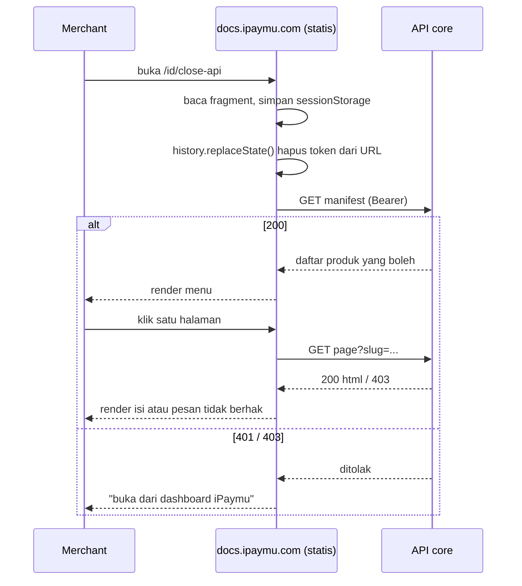

# Rencana Close API — Sisi Dokumentasi (repo ini)

Pasangan dokumen: [`PLAN-close-api-core.md`](./PLAN-close-api-core.md) (sisi ipaymu-core).
Kontrak API antar keduanya ada di §4 dan **harus identik** di kedua dokumen.

Menggantikan: `PLAN-close-api-gating.md` (draf gabungan, sudah dihapus).

---

## 1. Keputusan yang Sudah Dikunci

| Hal | Keputusan |
| :-- | :-- |
| Bentuk | **Opsi C** — situs tetap satu bundel statis, konten diambil runtime dari API core |
| Hosting | Tetap statis (Hostinger), tidak ada proses server milik docs |
| Domain final | `https://docs.ipaymu.com` |
| Granularitas akses | **Per produk**, sesuai tabel §3 |
| Audit trail | Tidak perlu |
| Sandbox | Diperlakukan sama dengan produksi, tidak dipisah |
| Kesiapan core | Siap membangun sisi server |

---

## 2. Prinsip yang Tidak Boleh Dilanggar

> **Konten Close API tidak boleh ikut ke dalam `out/`.**

Bundel statis itu publik sepenuhnya. Kalau HTML Close API ada di dalamnya, dokumen
itu sudah bocor — tidak peduli menunya disembunyikan atau route-nya "dirahasiakan".
View-source, URL langsung, dan berkas `_next/*.txt` semuanya bisa diakses siapa pun.

Yang boleh ada di bundel publik hanyalah **cangkang kosong**: kerangka halaman yang
belum berisi apa-apa sampai ia berhasil mengambil konten dari API terautentikasi.

Pemisahan ini sudah setengah jalan di repo:

| Sudah ada | Fungsi |
| :-- | :-- |
| `content/close-api/` | 16 MDX (8 halaman × id/en) |
| `private/close-api/` | Route di luar `src/app`, hanya dipasang saat build privat |
| `scripts/clean-staged.mjs` | Bersihkan sisa route sebelum build publik |
| `scripts/with-close-api.mjs` | Build privat → `out-private/` |

Terverifikasi hari ini: `out/` mengandung **0** berkas dan **0** string `close-api`.

---

## 3. Peta Produk → Halaman

| `product_slug` | Halaman yang dibuka |
| :-- | :-- |
| `register` | `register` |
| `transfer-va` | `transfer-va` |
| `profile` | `profile` |
| `verification` | `member-verification`, `merchant-verification`, `bank-list`, `business-category` |

Halaman ikhtisar (`/close-api` tanpa slug) boleh dibuka **semua akun yang punya
minimal satu produk** — isinya mekanisme signature bersama, bukan rahasia produk.

`bank-list` dan `business-category` adalah data master pendukung alur verifikasi;
sengaja dibundel ke produk `verification`.

---

## 4. Kontrak API (harus sama persis dengan sisi core)

Base URL mengikuti lingkungan akun: `https://my.ipaymu.com` atau
`https://sandbox.ipaymu.com`.

### 4.1 Manifest — penggerak menu

```http
GET /api/v2/close-api-docs/manifest?lang=id
Authorization: Bearer <jwt>
```

```json
{
  "products": [
    {
      "slug": "verification",
      "pages": [
        { "slug": "member-verification",   "title": "Member Verification" },
        { "slug": "merchant-verification", "title": "Merchant Verification" }
      ]
    }
  ]
}
```

Manifest **hanya memuat yang boleh dilihat**. Produk yang tidak dimiliki tidak
boleh muncul sama sekali — bukan muncul lalu ditandai terkunci.

### 4.2 Konten satu halaman

```http
GET /api/v2/close-api-docs/page?lang=id&slug=transfer-va
Authorization: Bearer <jwt>
```

```json
{
  "slug": "transfer-va",
  "title": "Split Payment (Transfer VA)",
  "html": "<h2>Endpoint</h2>...",
  "toc": [{ "depth": 2, "title": "Endpoint", "url": "#endpoint" }]
}
```

### 4.3 Kode status

| Kode | Arti | Yang dilakukan docs |
| :-- | :-- | :-- |
| `200` | Boleh | Render |
| `401` | Token hilang/kedaluwarsa | Tampilkan ajakan buka ulang dari dashboard |
| `403` | Tidak berhak atas slug ini | Tampilkan "tidak punya akses" |
| `404` | Slug tidak dikenal | Halaman tidak ditemukan |

---

## 5. Alur di Sisi Docs



### Kenapa token lewat fragment (`#`), bukan query (`?`)

Fragment **tidak pernah dikirim ke server**. Ia tidak masuk access log Hostinger,
tidak bocor lewat header `Referer` saat merchant mengklik tautan keluar, dan tidak
tersimpan di log proxy perantara. Query string bocor di ketiganya.

Setelah dibaca, token langsung dihapus dari URL dengan `history.replaceState()`
supaya tidak ikut tersalin saat merchant menyalin alamat halaman.

Simpan di `sessionStorage`, **bukan** `localStorage` — hilang begitu tab ditutup.

---

## 6. Pekerjaan di Repo Ini

### 6.1 Route cangkang

Buat `src/app/[lang]/close-api/[[...slug]]/page.tsx` sebagai **client component**
yang tidak memuat konten apa pun saat build.

`generateStaticParams()` mengembalikan daftar slug dari `content/close-api/meta.json`
— hanya untuk membuat kerangka HTML-nya, **tanpa** menyentuh isi MDX. Nama slug
sendiri bukan rahasia; yang dirahasiakan isinya.

Konsekuensi penting: setelah ini `out/` akan berisi berkas `close-api/*.html`.
Pemeriksaan "0 string close-api" tidak lagi berlaku sebagai pengaman — diganti
pemeriksaan §6.4.

### 6.2 Modul token

Berkas baru, misal `src/lib/close-api-auth.ts`:

- `readTokenFromFragment()` — ambil `#token=`, simpan, bersihkan URL.
- `getToken()` — baca dari `sessionStorage`.
- `clearToken()` — dipanggil saat 401.

### 6.3 Menu

`baseOptions()` di `src/lib/layout.shared.tsx` saat ini menampilkan menu Close API
berdasarkan `NEXT_PUBLIC_PRIVATE_BUILD`. Ganti: menu dirender kalau manifest
berhasil diambil. Ini murni kosmetik — keamanan tetap di API, bukan di sini.

Perhatikan menu ini masuk `NavSection` yang baru saja diperbaiki; nilai
`"close-api"` sudah tersedia.

### 6.4 Pengaman kebocoran di CI

Ganti pemeriksaan lama dengan pemeriksaan berbasis isi. Ambil beberapa kalimat
penanda dari `content/close-api/*.mdx` dan pastikan tidak satu pun muncul di `out/`:

```bash
# gagalkan build kalau isi Close API bocor ke bundel publik
for s in "StringToSign" "api/v2/transferva" "api/v2/merchant-verification"; do
  if grep -rqF "$s" out/; then
    echo "::error::Konten Close API bocor ke bundel publik: $s"
    exit 1
  fi
done
```

Tambahkan langkah ini ke `.github/workflows/hostinger.yml` setelah build.

### 6.5 Rendering konten

Konten datang sebagai HTML dari API. **Jangan** `dangerouslySetInnerHTML` mentah-mentah.
Dua pilihan:

1. Core mengirim HTML yang sudah disanitasi, docs tetap menyaring ulang dengan
   allowlist tag (pendekatan sabuk-dan-bretel).
2. Core mengirim MDX terkompilasi, docs mengeksekusinya dengan peta komponen
   terbatas (`Callout`, `Tabs`, `Card`, tabel) — konsisten dengan halaman lain.

Pilihan 1 lebih sederhana dan cukup, mengingat sumber HTML-nya adalah MDX milik
tim sendiri, bukan input pengguna.

### 6.6 Artefak konten untuk core

Core tidak menyimpan MDX. Repo ini menghasilkan artefak yang dilayani core:

```
close-api-content/
├── manifest.json          # slug + judul per bahasa
├── id/<slug>.html
└── en/<slug>.html
```

Tambahkan skrip build (mis. `bun run build:close-api-content`) dan workflow yang
menerbitkan artefak ini untuk diambil core. Penulisan dokumen tetap MDX di repo ini
— alur kerja penulis tidak berubah.

### 6.7 Metadata

Halaman Close API wajib `noindex, nofollow`. Route privat lama sudah menerapkannya;
pertahankan di route cangkang yang baru.

---

## 7. Berkas yang Akan Disentuh

| Berkas | Perubahan | Status |
| :-- | :-- | :-- |
| `src/app/[lang]/close-api/page.tsx` | Cangkang (satu rute, sub-halaman ditangani klien) | **Selesai** |
| `src/app/[lang]/close-api/layout.tsx` | Layout + `current="close-api"` (DocsLayout, pohon kosong) | **Selesai** |
| `src/components/close-api/close-api-shell.tsx` | Cangkang klien: baca `#token`, panggil core, render | **Selesai** |
| `scripts/build-close-api-content.mjs` | Artefak konten untuk core | **Selesai** |
| `scripts/clean-staged.mjs` | Diarahkan ke `close-api-export` (bukan cangkang publik) | **Selesai** |
| `scripts/with-close-api.mjs` | Dihapus — digantikan skrip artefak | **Selesai** |
| `package.json` | `build:private`/`dev:private` → `build:close-api-content` | **Selesai** |
| `.gitignore` | Tambah `/close-api-content/` | **Selesai** |
| `src/lib/layout.shared.tsx` | Menu dari manifest, bukan flag build | Belum (opsional) |
| `.github/workflows/hostinger.yml` | Pengaman kebocoran di CI | Belum |

Catatan implementasi:

- **Tidak ada modul token di docs.** Cangkang hanya men-*decode* klaim `iss`
  (base64) untuk menentukan base URL core. Verifikasi tanda tangan tetap di core
  memakai secret yang tidak pernah dikirim ke browser — situs ini `output: export`,
  jadi secret apa pun di sini akan ikut terbundel dan bisa dipalsukan.
- **`private/` tetap dipakai**, bukan sebagai situs, melainkan sebagai perender
  MDX saat membuat artefak (`build:close-api-content`). `clean-staged.mjs` tetap
  ada sebagai pengaman.
- Rute cangkang **satu halaman** (`/[lang]/close-api`); perpindahan produk
  ditangani klien, sehingga tidak ada daftar slug yang perlu di-*prerender*.

---

## 8. Uji yang Wajib Lulus

- [ ] Buka `/id/close-api/transfer-va` **tanpa token** → tidak ada konten, muncul ajakan login.
- [ ] Token kedaluwarsa → 401, muncul ajakan buka ulang dari dashboard.
- [ ] Akun hanya punya `register` → buka `transfer-va` → 403, dan `transfer-va` **tidak muncul di menu**.
- [ ] Akses dicabut di DB saat tab masih terbuka → permintaan berikutnya ditolak.
- [ ] `grep -rF "StringToSign" out/` → tidak ada hasil.
- [ ] Lihat view-source halaman cangkang → tidak ada isi dokumen.
- [ ] Token tidak muncul di URL setelah halaman dimuat.
- [ ] Halaman Close API mengirim `noindex`.

Uji nomor 5 dan 6 yang paling penting: keduanya membuktikan bundel publik memang
tidak membawa rahasia.

---

## 9. Catatan Sandbox

Karena sandbox diperlakukan sama, cangkang harus tahu ke base URL mana ia bertanya.
Ambil dari klaim `iss` di dalam token, **jangan** dari input pengguna atau
konfigurasi build — satu bundel statis melayani kedua lingkungan.

---

## 10. Urutan Kerja

| Tahap | Isi | Tergantung core? |
| :-- | :-- | :-- |
| 1 | Skrip artefak konten (`close-api-content/`) | tidak |
| 2 | Modul token + cangkang route | tidak (bisa pakai API tiruan) |
| 3 | Menu dari manifest | ya |
| 4 | Rendering konten + status 401/403 | ya |
| 5 | Pengaman kebocoran di CI | tidak |
| 6 | Uji tembus §8 | ya |

Tahap 1, 2, dan 5 bisa dikerjakan paralel dengan core memakai API tiruan.
