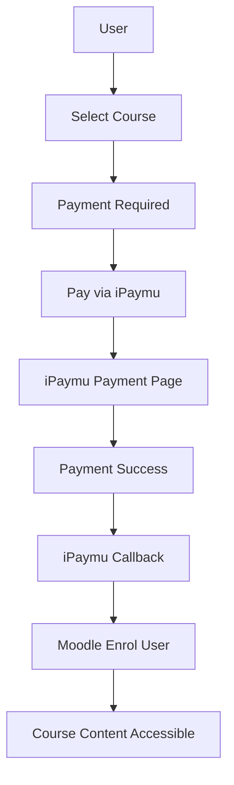

import { Callout } from "fumadocs-ui/components/callout";

## Introduction

### What is the Moodle Plugin?

The **Moodle Plugin** is an add-on component that can be integrated into the Moodle e-learning platform to extend its functionality. Moodle, as a popular online learning platform, is designed with flexibility that allows users to customize the learning experience to their needs.

Plugins allow Moodle administrators to extend the platform's capabilities by adding new features such as advanced assessment tools, payment system integrations, additional communication tools, and much more.

### Benefits of Using the Moodle Plugin with iPaymu

- **Easy Payments** — Course participants can make payments using various methods available on iPaymu.
- **Secure Transactions** — iPaymu provides a high level of security, allowing participants to make payments safely without worrying about data leaks or fraud.
- **Automatic Processing** — iPaymu processes payments automatically, saving time and effort for course organizers.

---

## Requirements

<Callout type="warn" title="Pre-Installation Requirements">
  Before getting started, make sure:

  - Moodle is installed
  - You have an iPaymu account ([Sign up here](https://ipaymu.com/))
  - You have your **API Key** and **VA Number** from your iPaymu account
  - You have admin access to your Moodle site
</Callout>

---

## Step 1: Download the Plugin

Download the Moodle plugin from the [iPaymu Plugin page](https://ipaymu.com/id/plugin-download/).

<Callout type="info" title="Preparation">
  - Download the Moodle plugin from the link above.
  - Make sure you have an iPaymu account. [Click here](https://ipaymu.com/) if you don't have one yet.
  - Copy your **API Key** and **VA Number** from your iPaymu merchant account.
</Callout>

---

## Step 2: Install the Plugin in Moodle

1. Log in as **Admin** to your Moodle site.

2. Navigate to **Site administration** → **Plugins** → **Install plugins**.

3. Click the **Choose a file** button or drag and drop the plugin `.zip` file into the available box.

4. Click **Install plugin from the ZIP file**.

5. Click **Continue** after the installation is complete.

---

## Step 3: Database Configuration

1. Scroll down and click the **Continue** button.

2. Click **Upgrade Moodle database now**.

3. If successful, a message will appear confirming the plugin was installed successfully.

---

## Step 4: Configure iPaymu Environment

1. Set the **Environment** field (`Sandbox` or `Production`).

2. Enter your **API Key** and **VA Number** from your iPaymu account.

<Callout type="info" title="Sandbox Mode">
  Use **Sandbox** mode for testing before switching to **Production** mode.
</Callout>

---

## Step 5: Enable the Enrolment Plugin

1. Enable the **iPaymu Payment Enrolment Plugin**.

2. Make sure the plugin is active with the **eye** icon glowing blue.

---

## Step 6: Create a Course

1. Create a new course by clicking **New Course**, and use **Manage Course** to organize course categories.

2. Fill in the course description, then click **Save and display** at the bottom.

---

## Step 7: Enable Payment for a Course

1. Enable paid courses by clicking the **Participants** tab.

2. Click **Enrolment methods**.

3. Click **Add method**, then select **iPaymu Payment**.

4. Fill in the available fields:
   - **Name/Description** of the payment method
   - **Price** of the course

5. Click **Add method** to save.

---

## Step 8: User Perspective

1. When the course is clicked, a view will appear requesting the user to make a payment before accessing the course content.

2. Click **Pay via iPaymu**.

3. The user will be redirected to the **iPaymu payment page**.

4. After the user successfully completes payment, the view will change and display the course content.

---

## Integration Flow

