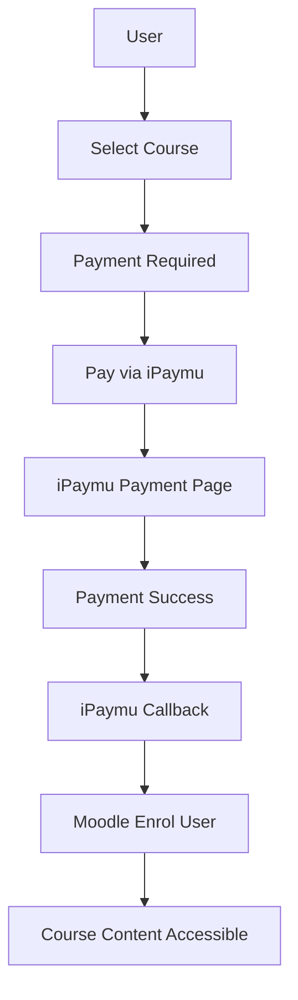

import { Callout } from "fumadocs-ui/components/callout";

## Pendahuluan

### Apa itu Plugin Moodle?

**Plugin Moodle** adalah komponen tambahan yang dapat diintegrasikan ke dalam platform e-learning Moodle untuk menambahkan fungsi atau fitur tertentu. Moodle, sebagai platform pembelajaran online yang populer, dirancang dengan fleksibilitas yang memungkinkan pengguna untuk menyesuaikan pengalaman pembelajaran sesuai kebutuhan.

Plugin memungkinkan administrator Moodle untuk memperluas fungsionalitas platform dengan menambahkan fitur baru, seperti alat evaluasi yang lebih kompleks, integrasi dengan sistem pembayaran, alat komunikasi tambahan, dan banyak lagi.

### Manfaat Menggunakan Plugin Moodle dengan iPaymu

- **Kemudahan Pembayaran** — Peserta kursus dapat melakukan pembayaran dengan berbagai metode yang tersedia di iPaymu.
- **Keamanan Transaksi** — iPaymu memiliki tingkat keamanan yang tinggi, sehingga peserta dapat melakukan pembayaran secara aman tanpa khawatir tentang kebocoran data atau penipuan.
- **Pemrosesan Otomatis** — iPaymu memproses pembayaran secara otomatis, menghemat waktu dan tenaga bagi penyelenggara kursus.

---

## Persyaratan

<Callout type="warn" title="Persyaratan Sebelum Instalasi">
  Sebelum memulai, pastikan:

  - Moodle sudah terinstall
  - Memiliki akun iPaymu ([Daftar di sini](https://ipaymu.com/))
  - Sudah mendapatkan **API Key** dan **VA Number** dari akun iPaymu
  - Memiliki akses admin ke situs Moodle
</Callout>

---

## Step 1: Download Plugin

Download plugin Moodle dari halaman [Plugin iPaymu](https://ipaymu.com/id/plugin-download/).

<Callout type="info" title="Persiapan">
  - Download plugin Moodle dari link di atas.
  - Pastikan kamu memiliki akun iPaymu. [Klik di sini](https://ipaymu.com/) jika belum memiliki akun.
  - Copy **API Key** dan **Nomor VA** merchant iPaymu kamu.
</Callout>

---

## Step 2: Install Plugin di Moodle

1. Login sebagai **Admin** ke situs Moodle kamu.

2. Buka **Site administration** → **Plugins** → **Install plugins**.

3. Klik tombol **Choose a file** atau seret dan lepaskan file `.zip` plugin ke dalam kotak yang tersedia.

4. Klik **Install plugin from the ZIP file**.

5. Klik **Continue** setelah instalasi selesai.

---

## Step 3: Konfigurasi Database

1. Scroll ke bawah, lalu klik tombol **Continue**.

2. Klik **Upgrade Moodle database now**.

3. Jika berhasil, akan muncul keterangan bahwa plugin berhasil diinstall.

---

## Step 4: Konfigurasi Environment iPaymu

1. Berikan nilai pada field **Environment** (`Sandbox` atau `Production`).

2. Masukkan **API Key** dan **VA Number** dari akun iPaymu Anda.

<Callout type="info" title="Mode Sandbox">
  Gunakan mode **Sandbox** untuk melakukan testing terlebih dahulu sebelum beralih ke mode **Production**.
</Callout>

---

## Step 5: Aktifkan Plugin Enrolment

1. Aktifkan **Plugin Enrolment** iPaymu Payment.

2. Pastikan plugin aktif dengan ikon **mata** yang menyala biru.

---

## Step 6: Buat Course

1. Buat course baru dengan mengklik **New Course**, dan gunakan **Manage Course** untuk mengatur kategori course.

2. Isi keterangan course, lalu di akhir klik tombol **Save and display**.

---

## Step 7: Aktifkan Pembayaran untuk Course

1. Aktifkan course berbayar dengan mengklik tab **Participants**.

2. Klik **Enrolment methods**.

3. Klik **Add method**, lalu pilih **iPaymu Payment**.

4. Isi keterangan pada field yang tersedia:
   - **Nama/Deskripsi** metode pembayaran
   - **Harga** course

5. Klik **Add method** untuk menyimpan.

---

## Step 8: Tampilan dari Sudut Pandang User

1. Ketika course tersebut diklik, akan muncul tampilan yang meminta user untuk melakukan pembayaran terlebih dahulu sebelum melihat isi course.

2. Klik **Pay via iPaymu**.

3. User akan diarahkan ke **halaman pembayaran iPaymu**.

4. Setelah user berhasil melakukan pembayaran, tampilan akan berubah dan menunjukkan isi materi course.

---

## Flow Integrasi

