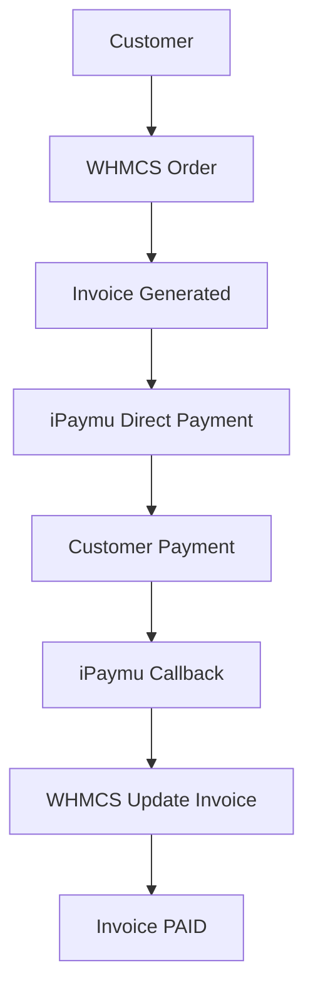

import { Callout } from "fumadocs-ui/components/callout";

## Introduction

### What is WHMCS?

**WHMCS** (Web Host Manager Complete Solution) is a hosting business automation platform widely used by:

- Hosting Providers
- Domain Registrars
- Web Agencies
- IT Professionals
- Developers

### Key Features of WHMCS

- Billing Management
- Payment Management
- Order Management
- Customer Support
- Reporting
- Domain Registration
- Hosting Provisioning
- Fraud Protection
- Customer Account Management

Beyond hosting, WHMCS can also be used for other products such as **VPS**, **VPN**, **Email Hosting**, **Game Server**, **Domain Service**, and other digital products.

---

## Requirements

<Callout type="warn" title="Pre-Installation Requirements">
  Before getting started, make sure:

  - WHMCS is installed
  - You have an iPaymu account
  - You have your **API Key** and **VA Number**
  - You have **FTP** or **SSH** access to your server
</Callout>

---

## Step 1: Download the Plugin

Download the WHMCS plugin from the [iPaymu Plugin page](https://ipaymu.com/id/plugin-download/).


---

## Step 2: Manual Installation

### File Structure

After extracting the plugin, you will find the following files and folders:

```
callback/
ipaymu/
ipaymu.php
```

### Installation Steps

1. Copy the entire contents of the `callback/` folder to:

```
/modules/gateways/callback/
```

2. Copy the following files and folders:

```
ipaymu/
ipaymu.php
```

to:

```
/modules/gateways/
```

---

## Step 3: Activate the Module in WHMCS

1. Go to **Settings** → **Apps & Integrations**.


2. Select **Browse** → **Payments**.


3. Find **iPaymu Direct Payment**, then click **Activate**.


4. Once activated, the **Active** status will appear. Click **Manage**.


---

## Step 4: Configure iPaymu

1. Enter the following configuration:

| Field | Value |
|---|---|
| **Environment** | `Sandbox` or `Production` |
| **VA Number** | Your iPaymu account VA Number |
| **API Key** | Your iPaymu account API Key |

2. Click **Save Changes**.


<Callout type="info" title="Sandbox Mode">
  Use **Sandbox** mode for testing before switching to **Production** mode.
</Callout>

---

## Step 5: Configure Products

1. Set up the **Product Name**, **Description**, and **Product Display**.


2. Create a **Product Group**, then add a **Product**.


3. Configure **Product Pricing** as needed, for example:
   - Monthly
   - Quarterly
   - Semi Annually
   - Annually


---

## Step 6: Purchase Simulation

1. The customer selects a product, then clicks **Order Now**.


2. The customer proceeds to **Checkout**.


3. Under **Payment Details**, select **iPaymu Direct Payment**, then click **Complete Order**.


---

## Step 7: Invoice Payment

1. The invoice is created and the **Pay** button appears.


2. The customer is redirected to the iPaymu payment page.


---

## Step 8: Payment Status

1. After successful payment, the invoice shows a success status.


2. The invoice status changes to **PAID**.


---

## Error Handling

If the invoice amount does not meet the requirements or there is a configuration error, the system will display an error message.


<Callout type="info" title="Troubleshooting Tips">
  - Make sure your **API Key** and **VA Number** are correct.
  - Ensure the **Environment** is set correctly (Sandbox for testing, Production for live).
  - Verify that the callback URL is accessible from the iPaymu server.
</Callout>

---

## Integration Flow


