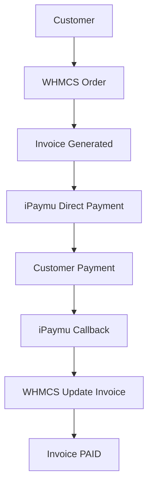

import { Callout } from "fumadocs-ui/components/callout";

## Pendahuluan

### Apa itu WHMCS?

**WHMCS** (Web Host Manager Complete Solution) adalah platform otomatisasi bisnis hosting yang banyak digunakan oleh:

- Hosting Provider
- Domain Registrar
- Web Agency
- IT Professional
- Developer

### Fungsi Utama WHMCS

- Billing Management
- Payment Management
- Order Management
- Customer Support
- Reporting
- Domain Registration
- Hosting Provisioning
- Fraud Protection
- Customer Account Management

Selain hosting, WHMCS juga dapat digunakan untuk produk lain seperti **VPS**, **VPN**, **Email Hosting**, **Game Server**, **Domain Service**, dan produk digital lainnya.

---

## Persyaratan

<Callout type="warn" title="Persyaratan Sebelum Instalasi">
  Sebelum memulai, pastikan:

  - WHMCS sudah terinstall
  - Memiliki akun iPaymu
  - Sudah mendapatkan **API Key** dan **VA Number**
  - Memiliki akses **FTP** atau **SSH** ke server
</Callout>

---

## Step 1: Download Plugin

Download plugin WHMCS dari halaman [Plugin iPaymu](https://ipaymu.com/id/plugin-download/).


---

## Step 2: Instalasi Manual Plugin

### Struktur File

Setelah plugin diekstrak, akan terdapat file dan folder berikut:

```
callback/
ipaymu/
ipaymu.php
```

### Langkah Instalasi

1. Copy seluruh isi folder `callback/` ke direktori:

```
/modules/gateways/callback/
```

2. Copy file dan folder berikut:

```
ipaymu/
ipaymu.php
```

ke direktori:

```
/modules/gateways/
```

---

## Step 3: Aktivasi Module di WHMCS

1. Masuk ke **Settings** → **Apps & Integrations**.


2. Pilih **Browse** → **Payments**.


3. Cari **iPaymu Direct Payment**, lalu klik **Activate**.


4. Setelah aktif, akan muncul status **Active**. Klik **Manage**.


---

## Step 4: Konfigurasi iPaymu

1. Masukkan konfigurasi berikut:

| Field | Nilai |
|---|---|
| **Environment** | `Sandbox` atau `Production` |
| **VA Number** | VA Number akun iPaymu Anda |
| **API Key** | API Key akun iPaymu Anda |

2. Klik **Save Changes**.


<Callout type="info" title="Mode Sandbox">
  Gunakan mode **Sandbox** untuk melakukan testing terlebih dahulu sebelum beralih ke mode **Production**.
</Callout>

---

## Step 5: Konfigurasi Produk

1. Atur **Nama Produk**, **Deskripsi**, dan **Tampilan Produk**.


2. Buat **Product Group**, kemudian tambahkan **Product**.


3. Atur **Pricing Produk** sesuai kebutuhan, misalnya:
   - Monthly
   - Quarterly
   - Semi Annually
   - Annually


---

## Step 6: Simulasi Pembelian

1. Customer memilih produk, lalu klik **Order Now**.


2. Customer melakukan **Checkout**.


3. Pada bagian **Payment Details**, pilih **iPaymu Direct Payment**, lalu klik **Complete Order**.


---

## Step 7: Pembayaran Invoice

1. Invoice berhasil dibuat dan muncul tombol **Bayar**.


2. Customer diarahkan ke halaman pembayaran iPaymu.


---

## Step 8: Status Pembayaran

1. Setelah pembayaran sukses, invoice menampilkan status berhasil.


2. Status invoice berubah menjadi **PAID**.


---

## Penanganan Error

Jika nominal invoice tidak memenuhi syarat atau terdapat kesalahan konfigurasi, sistem akan menampilkan pesan error.


<Callout type="info" title="Tips Troubleshooting">
  - Pastikan **API Key** dan **VA Number** sudah benar.
  - Pastikan **Environment** sesuai (Sandbox untuk testing, Production untuk live).
  - Periksa callback URL sudah dapat diakses oleh server iPaymu.
</Callout>

---

## Flow Integrasi


